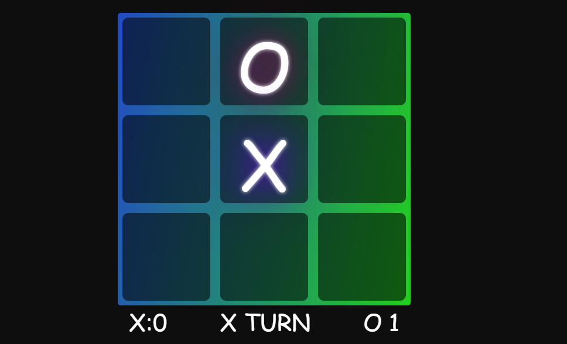

# Tic Tac Toe Game

**Tic Tac Toe** is a classic two-player game where each player tries to align three of their symbols (X or O) in a row, either horizontally, vertically, or diagonally. This version is built using **HTML**, **CSS**, and **JavaScript** to provide a simple yet engaging user interface.

## Table of Contents
- [Features](#features)
- [How to Play](#how-to-play)
- [Installation and Usage](#installation-and-usage)
- [Project Files](#project-files)

## Features
- Simple and clean design.
- Two-player mode on the same device.
- Winning and draw notifications.

## How to Play
1. Choose your symbol (X or O) and take turns to place your mark in an empty cell.
2. The game alternates turns until one player aligns three symbols in a row or the game ends in a draw.
3. A message will appear indicating the winner or if it’s a draw.

## Installation and Usage
No installation is required. Simply download the files, and open `index.html` in your web browser to start the game.

## Project Files
- **index.html**: The main HTML file.
- **style.css**: CSS file for game styling.
- **script.js**: JavaScript file containing game logic.

